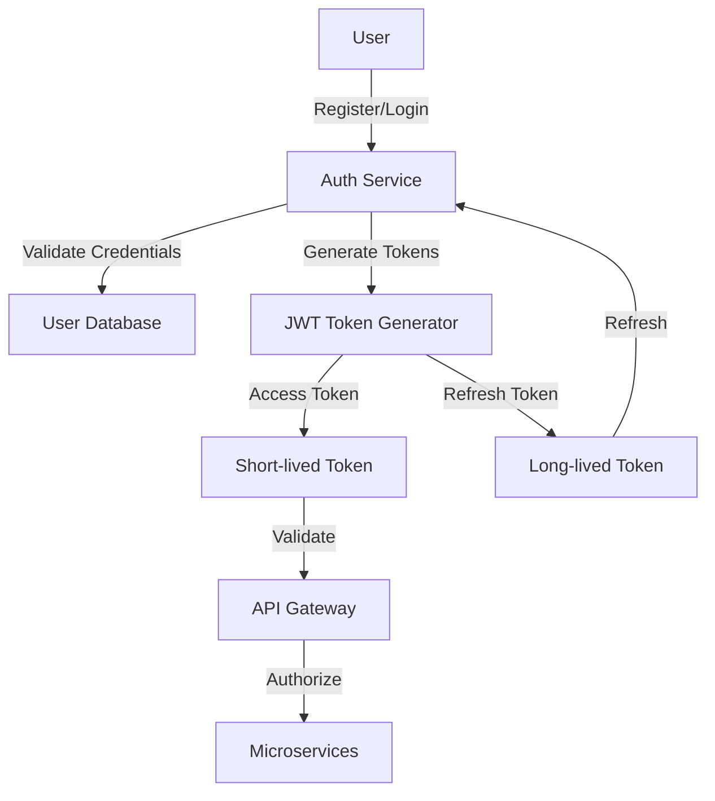

# 🔐 Technical Authentication Flow Implementation

## 🌐 Authentication Architecture

### Core Components
1. **Auth Service**: Token generation, validation
2. **User Service**: User management
3. **Redis**: Token blacklisting, rate limiting
4. **PostgreSQL**: User storage

## 🚪 Authentication Flow Diagram



## 🔑 Token Generation

### JWT Token Structure
```python
def generate_jwt_token(user_id, email, token_type='access'):
    payload = {
        'sub': str(user_id),           # Subject (User ID)
        'email': email,
        'iat': datetime.utcnow(),       # Issued At
        'exp': datetime.utcnow() + timedelta(
            minutes=ACCESS_TOKEN_EXPIRE_MINUTES if token_type == 'access' 
            else REFRESH_TOKEN_EXPIRE_MINUTES
        ),
        'type': token_type,             # Token Type
        'permissions': get_user_permissions(user_id)
    }
    
    return jwt.encode(
        payload, 
        settings.SECRET_KEY, 
        algorithm='HS256'
    )
```

### Token Validation Middleware
```python
class TokenValidator:
    @staticmethod
    def validate_token(token: str):
        try:
            # 1. Decode and verify signature
            payload = jwt.decode(
                token, 
                settings.SECRET_KEY, 
                algorithms=['HS256']
            )
            
            # 2. Check token type
            if payload['type'] != 'access':
                raise InvalidTokenError("Invalid token type")
            
            # 3. Check blacklist
            if TokenBlacklist.is_blacklisted(token):
                raise TokenBlacklistedError("Token has been revoked")
            
            # 4. Check expiration
            if datetime.utcnow() > datetime.fromtimestamp(payload['exp']):
                raise ExpiredTokenError("Token has expired")
            
            return payload
        
        except jwt.PyJWTError as e:
            logger.error(f"Token validation error: {e}")
            raise InvalidTokenError("Invalid token")
```

## 🛡️ Authentication Endpoints

### 1. Registration Endpoint
```python
@router.post("/register")
async def register_user(
    user_data: UserRegistrationSchema,
    db: Session = Depends(get_db)
):
    # 1. Validate input
    validate_registration_input(user_data)
    
    # 2. Check if user exists
    existing_user = db.query(User).filter_by(email=user_data.email).first()
    if existing_user:
        raise HTTPException(
            status_code=400, 
            detail="User already exists"
        )
    
    # 3. Hash password
    hashed_password = password_hasher.hash(user_data.password)
    
    # 4. Create user
    new_user = User(
        email=user_data.email,
        password_hash=hashed_password,
        is_active=True,
        is_verified=False
    )
    db.add(new_user)
    db.commit()
    
    # 5. Generate tokens
    access_token = generate_jwt_token(
        new_user.id, 
        new_user.email, 
        token_type='access'
    )
    refresh_token = generate_jwt_token(
        new_user.id, 
        new_user.email, 
        token_type='refresh'
    )
    
    return {
        "access_token": access_token,
        "refresh_token": refresh_token,
        "customer": {
            "id": new_user.id,
            "email": new_user.email,
            "profile": {
                "is_new": True
            }
        }
    }
```

### 2. Login Endpoint
```python
@router.post("/login")
async def login_user(
    login_data: UserLoginSchema,
    db: Session = Depends(get_db)
):
    # 1. Find user
    user = db.query(User).filter_by(email=login_data.email).first()
    if not user:
        raise HTTPException(
            status_code=401, 
            detail="Invalid credentials"
        )
    
    # 2. Verify password
    if not password_hasher.verify(
        login_data.password, 
        user.password_hash
    ):
        # Increment login attempts
        user.login_attempts += 1
        if user.login_attempts > MAX_LOGIN_ATTEMPTS:
            user.is_locked = True
        db.commit()
        
        raise HTTPException(
            status_code=401, 
            detail="Invalid credentials"
        )
    
    # 3. Reset login attempts
    user.login_attempts = 0
    user.last_login = datetime.utcnow()
    db.commit()
    
    # 4. Generate tokens
    access_token = generate_jwt_token(
        user.id, 
        user.email, 
        token_type='access'
    )
    refresh_token = generate_jwt_token(
        user.id, 
        user.email, 
        token_type='refresh'
    )
    
    return {
        "access_token": access_token,
        "refresh_token": refresh_token
    }
```

### 3. Token Refresh Endpoint
```python
@router.post("/refresh")
async def refresh_token(
    refresh_token_data: RefreshTokenSchema,
    db: Session = Depends(get_db)
):
    try:
        # 1. Validate refresh token
        payload = TokenValidator.validate_token(
            refresh_token_data.refresh_token
        )
        
        # 2. Find user
        user = db.query(User).filter_by(id=payload['sub']).first()
        if not user:
            raise HTTPException(
                status_code=401, 
                detail="User not found"
            )
        
        # 3. Generate new tokens
        new_access_token = generate_jwt_token(
            user.id, 
            user.email, 
            token_type='access'
        )
        
        return {
            "access_token": new_access_token
        }
    
    except InvalidTokenError:
        raise HTTPException(
            status_code=401, 
            detail="Invalid refresh token"
        )
```

## 🛡️ Security Mechanisms

### Token Blacklisting
```python
class TokenBlacklist:
    @staticmethod
    def blacklist_token(token: str, expiry: int):
        """Add token to blacklist in Redis"""
        redis_client.setex(
            f"blacklist:{token}", 
            expiry, 
            "revoked"
        )
    
    @staticmethod
    def is_blacklisted(token: str) -> bool:
        """Check if token is blacklisted"""
        return redis_client.exists(f"blacklist:{token}")
```

### Rate Limiting Decorator
```python
def rate_limit(limit=100, window=3600):
    def decorator(func):
        @functools.wraps(func)
        async def wrapper(*args, **kwargs):
            # Get client IP or user ID
            identifier = get_request_identifier()
            
            # Check rate limit
            current_count = redis_client.incr(f"rate_limit:{identifier}")
            redis_client.expire(f"rate_limit:{identifier}", window)
            
            if current_count > limit:
                raise HTTPException(
                    status_code=429, 
                    detail="Too many requests"
                )
            
            return await func(*args, **kwargs)
        return wrapper
    return decorator
```

## 🚨 Error Handling Strategies

### Custom Authentication Exceptions
```python
class AuthenticationError(Exception):
    """Base authentication error"""
    pass

class InvalidCredentialsError(AuthenticationError):
    """Raised when login credentials are invalid"""
    pass

class TokenExpiredError(AuthenticationError):
    """Raised when token has expired"""
    pass

class TokenBlacklistedError(AuthenticationError):
    """Raised when token is blacklisted"""
    pass
```

## 🔍 Logging and Monitoring

### Authentication Logging
```python
def log_authentication_event(
    event_type: str, 
    user_id: Optional[int] = None, 
    details: Dict[str, Any] = {}
):
    """Log authentication-related events"""
    log_entry = {
        "timestamp": datetime.utcnow(),
        "event_type": event_type,
        "user_id": user_id,
        **details
    }
    
    # Store in database or send to logging service
    authentication_log_repository.create(log_entry)
```

## 🚧 Security Best Practices

1. Use strong, randomly generated secret keys
2. Implement token rotation
3. Short-lived access tokens
4. Secure token storage
5. HTTPS everywhere
6. Implement proper error handling
7. Log authentication events

---

**Version**: 1.0.0
**Last Updated**: July 2024
**Security Level**: Enterprise Grade 